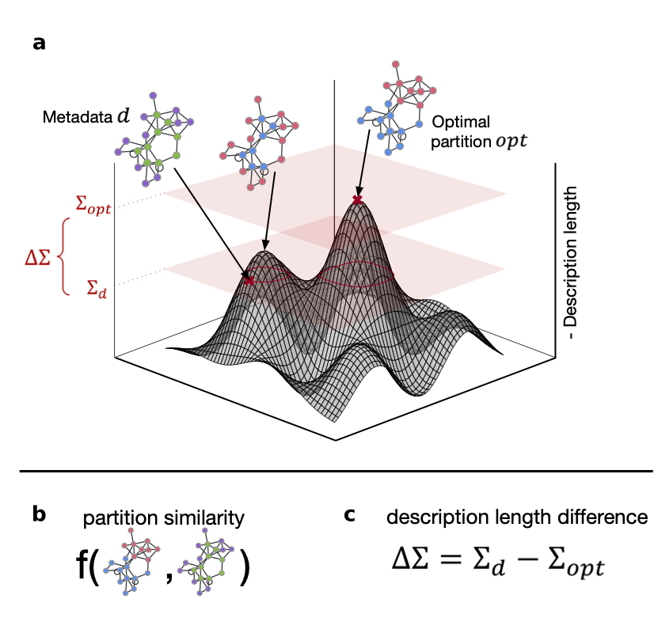

# metablox

metablox (metadata block structure exploration) is a Python library for quantifying the relationship between 
categorical node metadata and block structure of a network, as introduced in

[Lena Mangold and Camille Roth. “Quantifying metadata relevance to network block structure using description 
length”. Communications Physics 7.1 (2024), p. 331](https://www.nature.com/articles/s42005-024-01819-y).

Please cite the paper if you use the measure in your work.



## Installation

Clone this repository to your local machine:

```bash
git clone https://github.com/lenafm/metablox.git
```

Then `cd` into the created `metablox` directory and use `pip` to install the package locally (note that you need to
have the [graph-tool](https://graph-tool.skewed.de/installation.html) library installed for `metablox` to work).

``` 
pip install -e .
```

## Usage

To calculate the metablox vector $`\gamma`$ for a network with one or multiple sets of metadata, use the
`calculate_metadata_relevance` function. Here, we show this on a co-purchasing network of political books[^1], which 
includes a set of metadata of political leaning of the books (left, neutral, conservative), saved in a vertex property 
called `value`.

(For a slightly more detailed demonstration of the `calculate_metadata_relevance` function and of the built-in plotting 
method, see the `example.ipynb` notebook in the `notebooks` folder.)

```python
import graph_tool.all as gt
from metablox.gamma import calculate_metadata_relevance

g = gt.collection.ns["polbooks"]
metadata = ['value']

gamma, edge_compression = calculate_metadata_relevance(g=g, metadata=metadata, refine_states=True)
```

The `calculate_metadata_relevance` function returns a tuple with the values of $`\gamma`$ and the compression of each
SBM variant per network edge as a second dimension to the measure (as introduced in the paper).
The first element of the tuple (`gamma` in the above example) contains an entry for each element in the `metadata` list. 
For each metadata, it includes a nested dictionary with the elements of the $`\gamma`$ vector, with the key being
the SBM variant and the value being the value of $`\gamma`$ for this variant. The second element of the tuple contains
a dictionary with keys being SBM variants and values being the compression of the network under the optimal partition 
under the respective variant.

Notes:

* if you have a metadata partition for a network which you have not yet saved as a vertex property to the `graph-tool` 
Graph object, you can also pass the `metadata` as a list of `np.arrays`
* by default, `calculate_metadata_relevance` uses relevant functions from the `graph_tool` library for the
description length calculations; this can be changed by setting `use_gt = False`

## Contributing

Pull requests are welcome. For major changes, please open an issue first
to discuss what you would like to change.

Please make sure to update tests as appropriate.

## Funding

The research that was conducted to create the first version of this tool was funded by CNRS and the ERC Consolidator
Grant [Socsemics](https://socsemics.huma-num.fr/) (grant #772743).

## License

[MIT](https://choosealicense.com/licenses/mit/)

[^1]: V. Krebs, "The political books network", unpublished, https://doi.org/10.2307/40124305